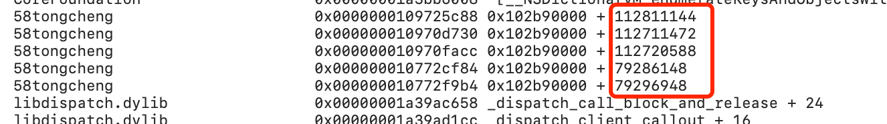

# 项目及功能介绍xxxx
# 基于Mach-O解析与反汇编技术的应用——WBBlades
## 背景
   随着公司业务不断扩展，APP体积也随之增大，APP包瘦身逐渐成为我们的重要任务；同时，APP崩溃问题也是我们关注的重点。为了解决现存问题，优化APP性能，我们基于Mach-O解析与反汇编技术，产出了三个工具——静态库体积分析工具，工程无用类检测工具，以及无符号崩溃解析工具，以帮助开发者从数据层面了解和优化APP。
   
   静态库体积分析工具可以帮助开发者快速评估一个静态库在链接到可执行程序后的体积，相比于同类工具，此工具无需开发者对代码进行编译链接，可以在静态库SDK在接入前获知接入的体积成本。无用类检测工具是基于Mach-O文件分析产生的数据，通过Mach-O文件分析和反汇编技术的应用，解决RN代码、类的动态调用、类的继承关系、自调用等问题，从一定程度上提高无用类检测的准确性。无符号日志解析工具可以帮助开发者在缺少符号表的情况下实现日志解析。
   
   除了命令行工具外，我们也为开发者提供了SDK-beta版，在APP中嵌入SDK，SDK会拦截并进行日志解析，其稳定性目前还未经过大量测试验证，开发者可以选择性接入。

## 环境安装
   * Mac
   * Xcode

## 使用
我们提供了两种使用方式，一种是直接使用我们提供的Mac应用；另一种是通过命令行工具，有利于接入自动化流程中。开发者可以根据自身情况选择性使用。

注意：使用工具时，物料（如APP、静态库、ips等）的路径不能出现空格或中文。
   
1. **静态库体积分析**：

   
   * 使用Mac应用

   将源码下载到本地，进入UIAPP文件夹，进入WBBladesForMac，打开WBBladesForMac.xcodeproj并运行。

   选择或拖入一个或多个路径，路径为目标静态库或其所在文件夹，不同路径间以空格隔开，路径中不可出现空格。点击“开始分析”按钮进行分析，分析结果会保存在*桌面/WBBladesResult.plist*文件中。点击“打开文件夹”，查看分析结果。
   	
   * 使用命令行

   下载源码，打开并运行WBBlades.xcodeproj。找到Products-WBBlades，将其拖入命令行。
   
   选择需要检测的可执行文件（.ipa或.app），检测所用的APP最好是Xcode本地打出来的Debug包；如果只需要检测部分静态库，则选择或拖入一个或多个目标静态库或其文件夹，路径间以空格隔开。点击“开始分析”按钮进行分析，分析结果会保存在*桌面/WBBladesClass.plist*文件中。点击“打开文件夹”，查看分析结果。
   
2. **无用类检测**：
	* 使用Mac应用

   将源码下载到本地，进入UIAPP文件夹，进入WBBladesForMac，打开WBBladesForMac.xcodeproj并运行。
   
   选择需要检测的可执行文件（.ipa或.app），检测所用的APP最好是Xcode本地打出来的Debug包；如果只需要检测部分静态库，则选择或拖入一个或多个目标静态库或其文件夹，路径间以空格隔开。点击“开始分析”按钮进行分析，分析结果会保存在*桌面/WBBladesClass.plist*文件中。点击“打开文件夹”，查看分析结果。

   * 使用命令行

   下载源码，打开并运行WBBlades.xcodeproj。找到Products-WBBlades，将其拖入命令行。
   
   在在刚刚拖入的WBBlades文件路径后面加空格，输入数字2，空格，拖入需要解析的app文件路径——最好是Xcode本地打出来的Debug包；如果只需要检测部分静态库，则拖入需要解析的静态库路径，可以拖入一个到多个，将只检测这些静态库下的类的使用情况；各参数间以空格隔开。
   
   输入参数示例：
   ```
	~/Build/Products/Debug/WBBlades 2 ~/58tongcheng.app ~/	libAudio.a ~/libHouseBusiness.a 
	```
按回车进行解析，解析结果会保存在*~/Desktop/WBBladesClass.plist*文件中。

3. **无符号崩溃解析**：
	* 使用Mac应用

   将源码下载到本地，进入UIAPP文件夹，进入WBBladesForMac，打开WBBladesForMac.xcodeproj并运行。
   
   选择或拖入崩溃的.app文件或其中的可执行文件；准备崩溃日志，崩溃日志可从手机设置——隐私——分析与改进——分析数据——yourAppName-xxxx-xx-xx-xxxxxx.ips中得到；将崩溃堆栈粘贴入文本框，点击“开始解析”，解析完毕后会自动打开结果文件WBBladesCrash.txt，解析结果会显示在下方文本框。
    
  * 使用命令行

   下载源码，打开并运行WBBlades.xcodeproj。找到Products-WBBlades，将其拖入命令行。
   
   在刚刚拖入的WBBlades文件路径后面加空格，输入数字3，空格，拖入需要解析的可执行文件（只能输入一个可执行文件），空格，输入崩溃日志的偏移地址组成的字符串，偏移地址间以英文“,“间隔，中间没有空格。    
     
输入参数示例：

   ```~/Build/Products/Debug/WBBlades 3 ~/58tongcheng.app 112811,112711472,112720588,79286148,79296948```

   按回车进行解析，解析结果会保存在*桌面/WBBladesCrash.plist*文件中。
   
## 持续改进

我们无法解决所有已知和未知问题，工具的准确性和稳定性上可能存在一定的不足。首先在语言支持上，我们支持Swift、C++、C、OC编写出来的二进制文件，但是主要还是针对OC代码编写的文件。在体积分析时，如果存在较多的Swift代码或者C++代码，那么可能会导致统计结果偏大。在使用无用类分析时，目前工具暂未解决字符串拼接后动态调用类的问题，如通过"WBTest"+"Cell"，则WBTestCell可能会被认为是无用类。由于Swift的兼具动态性和静态性，因此经过桥接的Swift代码能够被无符号工具扫描解析，纯Swift、C、C++由于在打包后缺少相应符号表，无法实现无符号日志解析。
    
## Developing for WBBlades
邓竹立

## Contributing for WBBlades
邓竹立，彭飞，朴惠姝，曾庆隆，林雅明

## Running samples
1. 下载[Demo](http://iwiki.58corp.com/wiki/wxios1/download/IOS/开源项目/开源规范/WebHome/Demo.zip "Demo")。
2. 安装WBBlades.dmg。
3. demo 所需物料在“test_need“文件夹下，主要包括：
（1）WBBladesDemoApp.app ：需要被分析的程序。
（2）crash.ips ：WBBladesDemoApp.app的崩溃日志。
（3）libStatic.a ：WBBladesDemoApp.app中所接入的SDK。
（4）物料APP及静态库源码 ：WBBladesDemoApp.app及libStatic.a的源码。
（5）Release版APP：WBBladesDemoApp.app打出来的Release版APP，体积分析结果的参照物。
